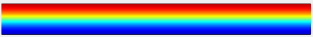

# Micromagnetic study of spin wave excitations in an antiferromagnetic domain wall

by _Hyeon-Kyu Park_

## I.	Introduction

In antiferromagnetic materials, the magnetic moments of atoms constituting a lattice are aligned in a staggered manner. In the simple case of a two-sublattice antiferromagnet, there are two possible states: one sublattice is occupied by up spins and the other by down spins, or vice versa. By the balance of the configurational entropy, macroscopic domains are formed depending on which antiferromagnetic state is realized. Antiferromagnetic domain walls, which separate between these bistable macroscopic domains, has been extensively studied owing to its operational feasibility in terms of nonexistence of Walker breakdown.

Since all the dipolar interactions which persist in antiferromagnets are cancelled by staggered spins, the determination of equilibrium configuration of antiferromagnetic domain walls solely depends on the exchange energy and the anisotropy energy. Therefore, an anitiferromagnetic domain wall always take the Walker type profile like its ferromagnetic counterpart.

For a Bloch-type ferromagnetic domain wall ( $\phi=90\degree$), there exists a family of spin wave eigenmodes (so-called “Winter modes”), which are localized in the direction perpendicular to the domain wall on a length scale $\Delta=\sqrt{A/K}$ but propagate as plane waves parallel to the domain wall. Here, $\Delta$ represents the characteristic wall width parameter where $A$ is the exchange stiffness and $K$ is the perpendicular anisotropy constant. These modes are exchange-dominated spin waves whose dispersion relation is gapless.

In this study, I numerically calculated the meta-stable configuration of an antiferromagnetic domain wall in a nanostrip, and unravel the spatial distribution and dispersions of spin wave excitations found in the antiferromagnetic domain wall.

## II. Research Methods

There are no micromagnetics simulation packages for simulating an antiferromagnet, although a few researchers tried using OOMMF[^1] and atomistic simulation codes[^2], which are made for simulating ferromagnets (Permalloy) and ferrimagnets (YIG). Here, I used a home-made code based on finite difference method and following two coupled Landau-Liftshitz-Gilbert equation for each sublattice ($i = 1, 2$) of antiferromagnets[^3],

$$\frac{d\mathbf{M}_i}{dt}=-\gamma\mu_0 \mathbf{M}_i \times \mathbf{H}_0^{\mathrm{eff}}+\frac{\alpha}{M_S} \left(\mathbf{M}_i \times \frac{d\mathbf{M} _i}{dt} \right)$$

where $\mathbf{M}{_ i}(\mathbf{r})=[M_i^x,M_i^y,M_i^z]\space\mathrm{(A/m)}$ is magnetization vector of $i$-th sublattice at position $\mathbf{r}$, gyromagnetic ratio $\gamma=1.761\times10^{11}\space\mathrm{rad/T\cdot s}$, vacuum permeability $\mu_0=4\pi\times10^{-7}\space\mathrm{T \cdot m/A}$, Gilbert damping constant $\alpha=0.5$, and saturation magnetization $M_S=1.162\times 10^6\space\mathrm{A/m}$. I used material parameter of iron-rhodium (FeRh). The effective field $\mu_0 H_i^{\mathrm{eff}}\space\mathrm{(T)}$ is given by $\mu_0 H_i^{\mathrm{eff}} =\frac{2K}{M_S^2}m_i^z\hat{z}+\frac{2A}{M_S^2}\nabla^2\mathbf{m}{_ i}-\frac{2J}{M_S^2}\mathbf{m}{_ {\bar{i}}}+\mu_0\mathbf{h}{_ {\mathrm{Zeeman}}}$. Here, anisotropy constant $K=730\space \mathrm{J/m^3}$[^4], exchange stiffness $A=4\times10^{-12}\space\mathrm{(J/m)}$[^5], interlattice coupling constant $J=1.2\times10^{3}\space\mathrm{(J/m^3)}$, and is Zeeman external field $\mu_0\mathbf{h}_{\mathrm{Zeeman}}$. Also, pointwise constraint $\Vert{\mathbf{M}_1}\Vert=\Vert{\mathbf{M}_2}\Vert=M_S$ is adapted.

In order to obtain a meta-stable antiferromagnetic domain wall profile, I initially made a Walker profile, $M_x=\tanh(\frac{y-y_0}{\Delta})$, $M_y=0$, and $M_z=\mathrm{sech}(\frac{y-y_0}{\Delta})$ with the wall width $\Delta=\sqrt{A/K}$ and $y_0$ being the $y$-coordinate of the wall center. Then, the wall profile was relaxed according to 4-th order Runge-Kutta method with time step of $5\times10^{-6}\space\mathrm{ns}$.

## III. Results
 
 ### A. Relaxation for 100 ns ($\alpha=0.5$) : 2019/07/08 ~ 2019/07/10
First, I found the meta-stable configuration of domain wall structure by relaxing with a high damping constant of $\alpha=0.5$. Also, the boundary conditions at the upper boundary ($M_1^z=+1$) and at the lower boundary ($M_1^z=-1$) are applied. Without these, the domain wall structure tends to relax in a single-domain structure.
_Figure 1_ shows the distribution of $M_1^z$ before the relaxation started ($t=0\space\mathrm{ns}$). 

[^1]:Xichao Zhang, Yan Zhou, and Motohiko Ezawa. Antiferromagnetic Skyrmion: Stability, Creation and Manipulation. *Sci. Rep.* **6**, 24795 (2016).
Chendong Jin, Chengkun Song, Jianbo Wang, and Qingfang Liu. Dynamics of antiferromagnetic skyrmion driven by the spin Hall effect. *Appl. Phys. Lett.* **109**, 182404 (2016).
Joseph Barker and Oleg A. Tretiakov. Static and Dynamical Properties of Antiferromagnetic Skyrmions in the Presence of Applied Current and Temperature. *Phys. Rev. Lett.* **116**, 147203 (2016).
[^2]:Sarah Jenkins, and Richard F. L. Evans. Enhanced finite size and interface mixing effects in iridium manganese ultra thin films. *J. Appl. Phys.* **124**, 152105 (2018).
[^3]:Jin Lan, Weichao Yu, and Jiang Xiao. Antiferromagnetic domain wall as spin wave polarizer and retarder. _Nat. Comm._ **8**, 178 (2017).
C. Kittel. Theory of antiferromagnetic resonance. _Phys. Rev._ **82**, 565–565 (1951).
[^4]:Marco Menarini, Rajasekhar Medapalli, Eric E. Fullerton, and Vitaliy Lomakin. Micromagnetic simulation of THz signals in antiferromagnetic FeRh by sub-picosecond thermal pulses. _AIP Advances_ **9**, 035040 (2019).
[^5]:E. Mancini, F. Pressacco, M. Haertinger, E. E. Fullerton, T. Suzuki, G. Woltersdorf and C. H. Back. Magnetic phase transition in iron–rhodium thin films probed by ferromagnetic resonance. _J. Phys. D: Appl. Phys._ **46** 245302 (2013).
